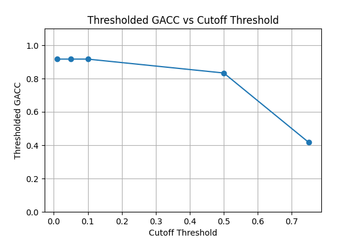
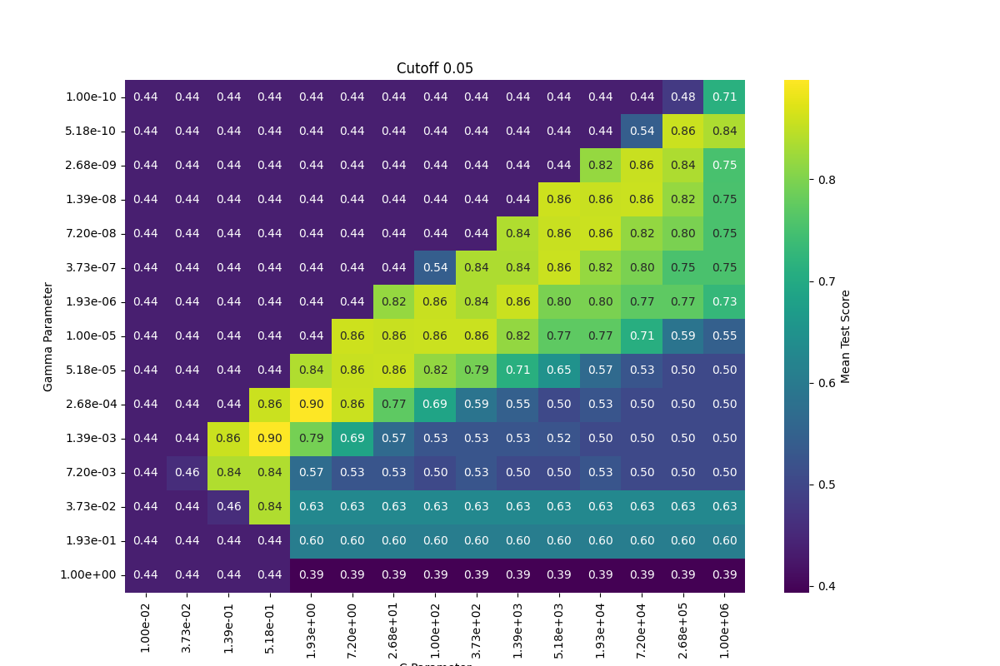
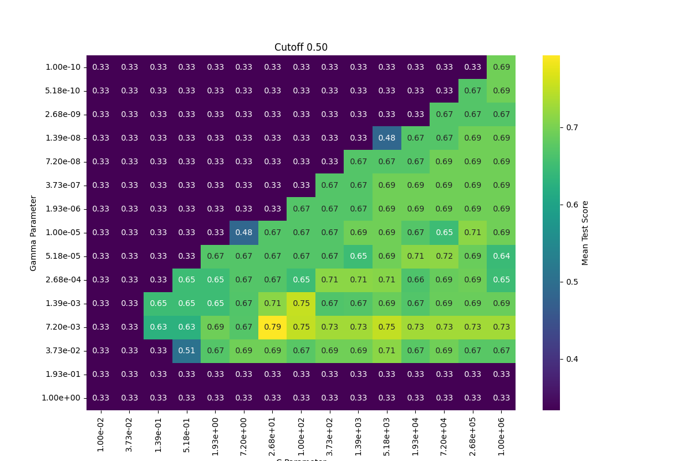

# TRESH-GACC: Thresholded Group Accuracy for Medical Imaging

A machine learning project implementing and evaluating TRESH-GACC (Thresholded Group Accuracy), a novel evaluation metric designed for medical imaging applications where predictions are aggregated at the patient level.

## Project Overview

This project addresses the challenge of evaluating machine learning models in medical imaging scenarios where:
- Individual samples (ROIs) belong to patients (groups)
- Patient-level decisions are more clinically relevant than ROI-level predictions
- A patient is classified as positive if a sufficient fraction of their ROIs are predicted as positive

The TRESH-GACC metric provides a threshold-based approach to convert individual ROI predictions into patient-level classifications, then measures accuracy at the patient level.

## Multiple Instance Learning (MIL) Context

This project is a direct application of **Multiple Instance Learning (MIL)**, a weakly supervised learning paradigm introduced by Dietterich et al. (1997). In classical MIL:

- A **bag** corresponds to a patient
- An **instance** corresponds to an ROI or image patch within that patient
- Bag labels are observed, but instance labels are not
- A bag is **positive** if it contains at least one positive instance (the standard assumption)

TRESH-GACC generalises the classical MIL bag-labelling rule. Instead of requiring at least one positive instance, it requires a **minimum fraction** (the cutoff threshold) of instances to be positive before the bag is considered positive:

| Cutoff | Equivalent MIL assumption |
|--------|---------------------------|
| ~0 (very small) | Standard MIL: one positive instance suffices |
| 0.5 | Majority vote across instances |
| 1.0 | All instances must be positive |

This threshold makes the metric more robust in settings where background noise or false positives at the instance level are expected — a common scenario in histopathology, radiology, and other patch-based imaging tasks.

The SVM trained here operates at the **instance level** (individual ROIs), but the model is evaluated entirely at the **bag level** (patients), which is the defining characteristic of MIL pipelines. A natural extension of this work would be to replace the instance-level SVM with a dedicated MIL algorithm (e.g., MI-SVM, attention-based MIL, or ABMIL).

## Project Structure

```
thresh_gacc/
├── data/
│   └── synthetic_mnist_data.pkl   # Generated by create_data.py
├── figures/
│   ├── thresholded_gacc_vs_cutoff.png
│   └── grid_search_cutoff_*.png
├── models/
│   ├── results_cutoff_*.pkl       # Trained GridSearchCV objects per threshold
│   └── results_cutoff_*.csv       # Test predictions per threshold
├── notebooks/
│   ├── develop_training.ipynb
│   └── visualize_gridsearch.ipynb
├── src/
│   ├── __init__.py
│   ├── create_data.py             # Synthetic dataset generation
│   ├── train.py                   # Main training pipeline
│   └── training_functions.py      # TRESH-GACC metric and plotting
├── .gitignore
├── README.md
└── requirements.txt
```

## Dataset

### Synthetic MNIST Patient Data
The project uses a synthetic medical imaging dataset created from MNIST digits:

- **60 patients** total (30 positive, 30 negative)
- **3-19 ROIs per patient** (randomly assigned)
- **Label 0 patients**: Only contain digit '9' images
- **Label 1 patients**: At least one digit '1' image, rest are '9's
- **784 features per ROI** (28x28 pixel values)

This setup simulates a medical scenario where positive patients have characteristic lesions (digit '1') among normal tissue (digit '9').

## TRESH-GACC Metric

### Definition
TRESH-GACC evaluates model performance by:

1. **Group Aggregation (true labels)**: For each patient, classify as positive if >= threshold fraction of their ROI true labels are positive
2. **Group Aggregation (predictions)**: Same aggregation applied to predicted labels
3. **Accuracy Calculation**: Standard accuracy between aggregated true and predicted patient labels

### Mathematical Formulation
```
For patient i with ROIs R_i and threshold τ:
patient_true_i  = 1 if (Σ y_true  ∈ R_i) / |R_i| ≥ τ else 0
patient_pred_i  = 1 if (Σ y_pred  ∈ R_i) / |R_i| ≥ τ else 0
TRESH-GACC = accuracy(patient_true, patient_pred)
```

> **Note**: In the synthetic dataset, all ROIs of a patient share the same label, so `patient_true` always equals the actual patient label regardless of threshold.

### Key Parameters
- **threshold/cutoff**: Fraction of positive ROIs needed for positive patient classification
- **groups**: Patient identifiers for ROI grouping
- **pos_label/neg_label**: Positive and negative class labels

## Usage

### 1. Environment Setup
```bash
# Create virtual environment
python -m venv venv
venv\Scripts\activate  # Windows
# source venv/bin/activate  # Linux/Mac

# Install dependencies
pip install -r requirements.txt
```

### 2. Generate Synthetic Data
```bash
python src/create_data.py
```

### 3. Run Training Pipeline
```bash
python src/train.py
```

### 4. Visualize Results
Open and run `notebooks/visualize_gridsearch.ipynb` to create heatmaps of grid search results.

## Methodology

### Machine Learning Pipeline
1. **Preprocessing**: StandardScaler -> PCA(25 components)
2. **Model**: SVM with RBF kernel
3. **Hyperparameter Optimization**: Grid search over C and gamma parameters
4. **Cross-validation**: 5-fold stratified group k-fold (maintains patient groups)
5. **Evaluation**: TRESH-GACC with varying thresholds (0.01 to 0.95)

### Hyperparameter Grid
- **C**: 15 values from 10^-1 to 10^9 (logarithmic spacing)
- **gamma**: 15 values from 10^-12 to 10^0 (logarithmic spacing)
- **Total combinations**: 225 per threshold

### Threshold Analysis
Evaluates 40 different threshold values to understand:
- Optimal threshold for best performance
- Sensitivity of metric to threshold choice
- Trade-offs between sensitivity and specificity at patient level

## Results and Analysis

### Output Files
- **Trained Models**: `models/results_cutoff_{threshold:.2f}.pkl`
- **Predictions**: `models/results_cutoff_{threshold:.2f}.csv`
- **Visualizations**: Heatmaps showing C vs. gamma parameter performance

### TRESH-GACC vs Cutoff Threshold

The plot below shows how test-set TRESH-GACC varies as the cutoff threshold is swept from 0.01 to 0.95. This captures how sensitive the bag-level metric is to the choice of aggregation threshold.



### Grid Search Results

The heatmaps below show mean cross-validation TRESH-GACC across the C and gamma hyperparameter grid for two representative thresholds. Bright regions indicate high-performing parameter combinations.

**Cutoff = 0.05** (few positive ROIs required for a positive patient label)



**Cutoff = 0.50** (majority of ROIs must be positive)



### Key Insights
- Performance varies significantly with threshold choice
- Optimal hyperparameters depend on the chosen threshold
- Visualization reveals "sweet spots" in parameter space

## API Reference

### Core Functions

#### `tresh_gacc_scorer(cutoff)`
Creates scikit-learn compatible scorer for TRESH-GACC metric.
- **Parameters**: `cutoff` (float) - Threshold for group classification
- **Returns**: Scorer object for use with GridSearchCV

#### `tresh_gacc(y_true, y_pred, groups, cutoff)`
Calculates TRESH-GACC metric directly.
- **Parameters**:
  - `y_true`, `y_pred` (array-like) - Individual ROI labels
  - `groups` (array-like) - Patient identifiers
  - `cutoff` (float) - Classification threshold
- **Returns**: Group accuracy score (0-1)

#### `group_predict(y_pred, groups, cutoff)`
Converts individual predictions to group-level predictions.
- **Parameters**: Individual predictions, group IDs, threshold
- **Returns**: Array of group-level predictions

#### `plot_grid_search_results(df, title, ax)`
Creates heatmap visualization of grid search results.
- **Parameters**: DataFrame with cv_results_, plot title, optional matplotlib axes
- **Returns**: Matplotlib axes object

## Dependencies

- **scikit-learn**: ML pipeline and algorithms
- **pandas**: Data manipulation and I/O
- **numpy**: Numerical computations
- **matplotlib/seaborn**: Visualization
- **jupyter**: Interactive notebooks

Full list in `requirements.txt`.

## References

- Dietterich, T. G., Lathrop, R. H., & Lozano-Perez, T. (1997). Solving the multiple instance problem with axis-parallel rectangles. *Artificial Intelligence*, 89(1-2), 31-71.
- Ilse, M., Tomczak, J., & Welling, M. (2018). Attention-based deep multiple instance learning. *ICML*. https://arxiv.org/abs/1802.04712
- MNIST Dataset: http://yann.lecun.com/exdb/mnist/
- Scikit-learn: https://scikit-learn.org/
